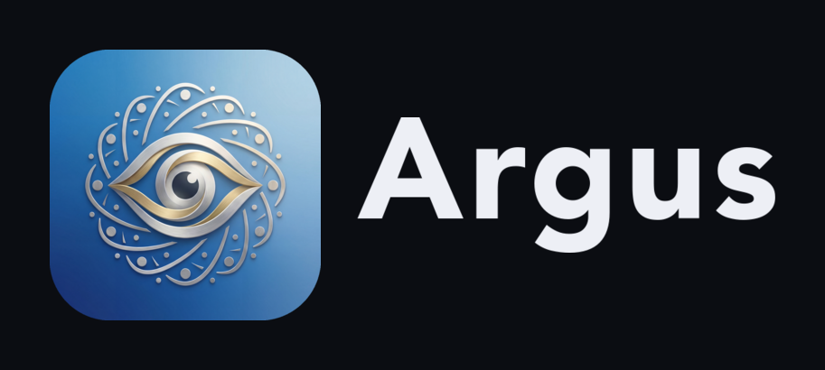

<p align="center"></p>

<p align="center"><b>One watchful eye over every coding agent, on every machine.</b></p>

<p align="center">
  <a href="LICENSE"></a>
  
  
  
</p>

<p align="center">
  <a href="https://pranjal2041.github.io/argus/"><b>Documentation</b></a> ·
  <a href="DESIGN.md">Architecture</a> ·
  <a href="#quickstart">Quickstart</a>
</p>

**Argus** is a native app (macOS · Android · Windows) that reaches every `claude`
coding-agent session across all your machines at once — your Mac, SLURM/HPC clusters,
Windows boxes, your phone — over [Tailscale](https://tailscale.com), peer-to-peer, with
**no central server**. Beyond terminals it's a cross-host **file explorer + editor** and a
**port-forward hub**. Argus Lab adds a recorded, human-approved experiment protocol, and the
Activity Journal turns your supervision into a durable ledger and Wrapped recap: one calm pane of
glass over a sprawl of agents and compute.

> Named for **Argus Panoptes**, the hundred-eyed giant who watched over everything.
> *(Formerly `universal_tmux`; the `ut` CLI and per-host broker keep that name internally —
> it's load-bearing for tailnet discovery.)*

---

## Why

Coding agents now run *everywhere* — a few on your laptop, a dozen on a cluster behind
SLURM, some on a Windows box, maybe one on your phone. Checking on them means a drawer full
of SSH sessions, port-forwards, and `tmux attach`, each tied to one host. Argus collapses
all of that into a single client that sees **every session on every machine** and tells you
which agents are **working**, **waiting on you**, or **idle** — so your attention goes where
it's needed instead of hunting for it.

It does this without a backend. Each host runs a small **broker**; the app dials those
brokers **directly over your tailnet** (encrypted, peer-to-peer). Nothing is centralized,
nothing is hosted, and a machine that goes away simply drops off the map.

## What it does

- **Command Center** — one card per agent, across every machine, with a plain-English line on
  what each is doing and which ones **need you**. A small model reads each session's screen
  (passively — nothing is ever typed into your agents) and labels it *working*, *needs you*,
  *stuck*, or *idle*; you can override a card by hand, and it syncs to your phone. Pending Lab
  access and experiment decisions share the same attention band and deep-link to their evidence.
- **Argus Lab** — a recorded research protocol for agent-run experiments. `ut lab run`
  mechanically captures code state, parameters, environment, declared-data fingerprints, logs,
  artifacts, and exit status; approval policies bind the exact proposal before expensive work
  starts. The macOS and Android hubs provide approvals, comparison, scoped human guidance,
  curation, archive/policy/key controls, shared-cluster deduplication, and offline mirrors.
  **Unattended Mode** can temporarily pre-authorize Lab access and run requests while you are away;
  every automatic approval is labeled in the append-only audit trail.
- **Workflows, Todo Maps & Notes** — three planning surfaces that **sync across your devices** (via
  your Mac's broker, no central server): saved **workflows** that spin up an agent in the right
  machine + folder with one click; per-session **todo** checklists that outlive the session; and a
  **notes** hub of free-form, time-grouped notes. Destructive syncs require explicit user intent,
  and Argus keeps seven daily recovery points for synced data, app preferences, and Lab metadata.
- **Terminals** — stream any session live (tmux control-mode on Unix, ConPTY on Windows) over a
  binary WebSocket. Full input, resize/reflow, 100k-line scrollback, auto-reconnect, create /
  rename / kill, find-in-terminal, a command palette, and a live running/idle dot per session
  (read passively from the screen, so it works with nothing attached). On macOS, an opt-in toggle
  keeps the Mac awake and reachable while the screen is locked.
- **Files** — a cross-host file explorer with **Monaco**, the editor that powers VS Code:
  per-file tabs, `⌘P` quick-open, `⇧⌘G` Go to Folder, content search, Git-aware tree coloring,
  live Markdown preview, syntax highlighting, image / PDF / media preview, upload & download, and
  *reveal-from-session* to jump to a session's working directory.
- **Git & pull-request review** — inspect working trees, commit graphs, blame, branches, and GitHub
  PR dossiers on the host that owns the repo. Ask free-form questions or generate cached agent
  insights over one commit, a range, a whole branch, or a PR; use explicit `gh` actions or jump
  to lazygit when review becomes mutation.
- **Ports** — a port-forward hub: bind a local port and tunnel it over the tailnet to any
  remote broker, no `ssh -L` juggling.
- **Dashboards & notebooks** — an in-app browser that discovers real HTTP services on remote
  listeners, persists tabs, supports find/zoom and per-tab auto-refresh, plus Jupyter notebooks
  whose **kernel runs on the host** while you edit from your Mac.
- **Weights & Biases** — when an agent prints a W&B run URL, open the run in-app, already logged in.
- **Activity Journal & Wrapped** — a local, append-only record of what you saw, said, and did across
  Mac and phone, with an in-app ledger. Wrapped reduces that event stream into a visual story and
  dashboard of your rhythm, fleet, delegation, interventions, experiments, and shipped work.
- **History & themes** — a durable record of every session that has run (name, node, folders) that
  survives a machine going offline; click a row to open the session, or re-create a finished one in
  its last folder. Plus themes that recolor the whole app: chrome, terminals, and editor.
- **`ut` CLI + mesh** — a drop-in for `tmux` that publishes a host to your tailnet, plus a small
  cross-host fabric (`ut exec` / `ut spawn` / `ut tail` / `ut cp`) to orchestrate work by host name.

## How it works

```
        ┌───────────────┐        Tailscale tailnet — WireGuard, peer-to-peer
        │   Argus app   │   ●─────────────────────────────────────────●
        │ mac · phone · │                       │
        │    windows    │   probes :8722 → GET /whoami identity handshake
        └───────┬───────┘   dials each broker it trusts, directly (no hub)
                │
   ┌────────────┼──────────────────┬─────────────────────┐
   ▼            ▼                  ▼                       ▼
┌─────────┐ ┌─────────┐      ┌──────────┐           ┌──────────┐
│ broker  │ │ broker  │      │  broker  │    ...    │  broker  │
│  Mac    │ │ Linux   │      │ Windows  │           │  phone   │
│ tmux-CC │ │ tmux-CC │      │  ConPTY  │           │  tsnet   │
└─────────┘ └─────────┘      └──────────┘           └──────────┘
```

The unit is the **tmux server (its socket)** — not a SLURM/PBS job — so the same binary
works identically on the cluster, a plain SSH box, or your Mac. The first `ut` on a socket
lazily starts **one broker** that every later `ut` reuses; it embeds `tsnet` (rootless, no
TUN) to join the tailnet, and exits when its host process tree is torn down so its device
auto-removes. Discovery is **capability-based, never by hostname**: the client probes each
online tailnet peer on `:8722` and trusts only those that return the broker identity
handshake. Full design in **[DESIGN.md](DESIGN.md)**.

## Quickstart

> **Prerequisite:** a [Tailscale](https://tailscale.com) tailnet that your machines (and the
> app) belong to. Brokers join rootlessly via an auth key; the macOS/Windows host can simply
> already be on the tailnet.

### 1 · Broker (every host you want to reach)

```sh
go build -o bin/ut-broker ./cmd/ut-broker

# Local (loopback) — the host is already on your tailnet:
./bin/ut-broker --listen 127.0.0.1:8722

# Or use the `ut` CLI, a drop-in for tmux that starts the broker for you:
ut                 # attach/create a session in $PWD and publish this server
ut my-experiment   # a named session (attach-or-create)
ut -L scratch      # a separate tmux server + broker, like `tmux -L`
```

### 2 · macOS app

```sh
cd clients/macos
swift build -c release && bash build-app.sh
cp -R Argus.app /Applications/ && open /Applications/Argus.app
```

### 3 · Android app

```sh
cd clients/android
bash dev-install.sh          # builds the debug APK and installs to the connected device
```

The phone joins the tailnet itself via an embedded `tsnet` core — paste a Tailscale auth key
in the app; no system Tailscale client or manual hostnames required.

The native Lab screen includes approvals, research records and artifacts, run comparison,
scoped guidance, archive/policy/key controls, Babel shared-store deduplication, and Lab items
in the Command Center. Approval notifications deep-link to the exact evidence dossier. The phone
can also turn Unattended Mode on or off through the Mac broker, including directly from Command
Center.

### 4 · Windows

Build `ut-broker` for Windows (`GOOS=windows go build ./cmd/ut-broker`) and run it on the
box; the broker speaks ConPTY behind the same interface. The macOS/Android apps reach it like
any other host.

### Web fallback

A zero-install **xterm.js** client lives in [`web/`](web/) — point it at a broker's
`--listen` address for a browser terminal when you can't install the native app.

## Documentation

Full docs—including Argus Lab, Git and PR review, the Activity Journal and Wrapped, installation,
architecture, the `ut` CLI, and the security model—live at
**[pranjal2041.github.io/argus](https://pranjal2041.github.io/argus/)**
(built with [Fumadocs](https://fumadocs.dev), source in [`docs/`](docs/)).

## Repository layout

| path | role |
|---|---|
| `cmd/ut-broker/`      | the per-host broker binary (Go) |
| `cmd/ut/`             | the `ut` CLI launcher |
| `internal/tmux/`      | tmux control-mode `SessionProvider` (the modular seam) |
| `internal/broker/`    | per-client WebSocket server + frame codec |
| `internal/fsvc/`      | the `/fs/*` file service (browse / search / read / write / upload) |
| `internal/labsvc/`    | append-only Lab records, approvals, snapshots, mirrors, and guidance |
| `internal/forward/`   | the port-forward agent |
| `internal/conpty/`    | Windows ConPTY `SessionProvider` |
| `clients/macos/`      | native macOS app (AppKit + SwiftTerm + CodeMirror) |
| `clients/android/`    | native Android app (Kotlin/Compose + embedded `tsnet`) |
| `web/`                | xterm.js web client (zero-install fallback) |
| `docs/`               | Fumadocs documentation site |

## Security

- All traffic rides your **Tailscale tailnet** (WireGuard) — brokers are reachable only by
  devices on your tailnet, never exposed publicly.
- Brokers run **as you**, on your own hosts; there is **no central server** to trust or
  breach. A dead host's broker auto-removes its tailnet device (ephemeral key).
- The broker only ever serves a host it was started on; discovery requires the
  `GET /whoami` identity handshake, so an unrelated service on `:8722` is never mistaken for
  one. Auth keys and other secrets are never committed (see [`.gitignore`](.gitignore)).
- The local Activity Journal records terminal messages as typed; disable it before entering secrets
  into a recorded pane. Lab intentionally stores experiment commands, diffs, configs, and logs.

## License

[MIT](LICENSE) © 2026 Pranjal Aggarwal
